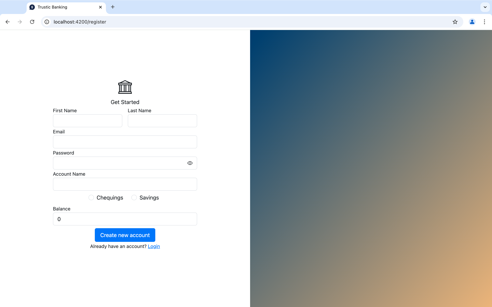
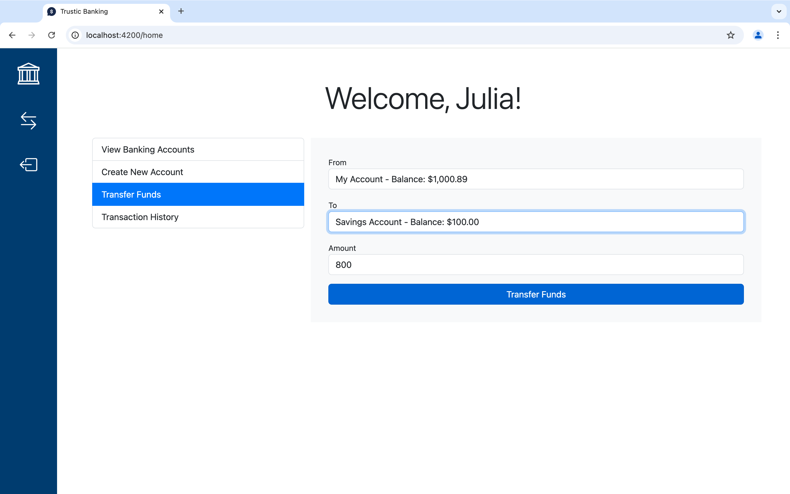

# Trustic Banking




A simple banking application for a fake bank named 'Trustic Banking'. Allows users to register an account, manage their banking accounts, transfer funds, and view past transactions. Built with Angular.

## Table of Contents

1. [Features](#features)
2. [Prerequisites](#prerequisites)
3. [Installation](#installation)
4. [Usage](#usage)

## Features

- **User Authentication**: Login and registration forms with form validation.
- **Account Management**: Users can view their bank accounts with details like balance and account name.
- **Fund Transfer**: Transfer funds between accounts.
- **Transaction History**: View and search through a list of recent transactions.
- **Real-time Updates**: Two-way data binding allows updates to reflect immediately across components.
- **Router**: Angular Router to navigate between the login/register pages and the home page.
- **Button**: Reusable button component that is shared across the application.

### Prerequisites

Ensure you have the following installed:

- [Node.js](https://nodejs.org/) (v14 or above)
- [Angular CLI](https://angular.io/cli)

### Installation

1. **Clone the Repository**:

   ```bash
   git clone https://github.com/jgfitzgerald/simple-banking-app.git
   cd simple-banking-app
   ```

2. **Install Dependencies**:

   ```bash
   npm install
   ```

3. **Run the App**:

   ```bash
   ng serve
   ```

The app will be available at `http://localhost:4200`.

## Usage

1. **Login/Register**: Create an account with any valid email.
2. **View Accounts**: On the dashboard, view a list of your bank accounts.
3. **Transfer Funds**: Select the accounts and amount to initiate a transfer.
4. **Transaction History**: Track your past transactions.
5. **Testing via Karma**:

   ```bash
   ng test
   ```
